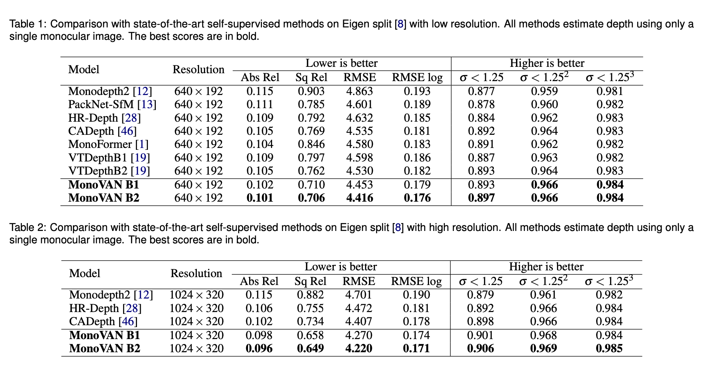

# MonoVAN

This is the reference PyTorch implementation for training and testing depth estimation models using the method described in

> **MonoVAN: Visual Attention for Self-Supervised Monocular Depth Estimation**
> 
> Ilya Indyk and Ilya Makarov

[//]: # (> [Clément Godard]&#40;http://www0.cs.ucl.ac.uk/staff/C.Godard/&#41;, [Oisin Mac Aodha]&#40;http://vision.caltech.edu/~macaodha/&#41;, [Michael Firman]&#40;http://www.michaelfirman.co.uk&#41; and [Gabriel J. Brostow]&#40;http://www0.cs.ucl.ac.uk/staff/g.brostow/&#41;)

[//]: # (> [ICCV 2019 &#40;arXiv pdf&#41;]&#40;https://arxiv.org/abs/1806.01260&#41;)

[//]: # (<p align="center">)
[//]: # (  )
[//]: # (</p>)


[//]: # (![alt text]&#40;assets/qualitative-nyu.png&#41;)


## ⚙️ Setup

Assuming a fresh [Anaconda](https://www.anaconda.com/download/) distribution, you can install the dependencies with:
```shell
pip install -r requirements.txt
```

We ran our experiments with PyTorch 1.13.0, CUDA 11.7, Python 3.10 and CentOS 7.

Note that our code is built based on [Monodepth2](https://github.com/nianticlabs/monodepth2).


## 📊Results on KITTY




## 💾 KITTI training data

You can download the entire [raw KITTI dataset](http://www.cvlibs.net/datasets/kitti/raw_data.php) by running:
```shell
wget -i splits/kitti_archives_to_download.txt -P kitti_data/
```
Then unzip with
```shell
cd kitti_data
unzip "*.zip"
cd ..
```
**Warning:** it weighs about **175GB**, so make sure you have enough space to unzip too!

Our default settings expect that you have converted the png images to jpeg with this command, **which also deletes the raw KITTI `.png` files**:
```shell
find kitti_data/ -name '*.png' | parallel 'convert -quality 92 -sampling-factor 2x2,1x1,1x1 {.}.png {.}.jpg && rm {}'
```
**or** you can skip this conversion step and train from raw png files by adding the flag `--png` when training, at the expense of slower load times.

The above conversion command creates images which match our experiments, where KITTI `.png` images were converted to `.jpg` on Ubuntu 16.04 with default chroma subsampling `2x2,1x1,1x1`.
We found that Ubuntu 18.04 defaults to `2x2,2x2,2x2`, which gives different results, hence the explicit parameter in the conversion command.

You can also place the KITTI dataset wherever you like and point towards it with the `--data_path` flag during training and evaluation.

**Splits**

The train/test/validation splits are defined in the `splits/` folder.
By default, the code will train a depth model using [Zhou's subset](https://github.com/tinghuiz/SfMLearner) of the standard Eigen split of KITTI, which is designed for monocular training.
You can also train a model using the new [benchmark split](http://www.cvlibs.net/datasets/kitti/eval_depth.php?benchmark=depth_prediction) or the [odometry split](http://www.cvlibs.net/datasets/kitti/eval_odometry.php) by setting the `--split` flag.


**Custom dataset**

You can train on a custom monocular or stereo dataset by writing a new dataloader class which inherits from `MonoDataset` – see the `KITTIDataset` class in `datasets/kitti_dataset.py` for an example.


## ⏳ Training

By default models are saved to `~/tmp/<model_name>`.
This can be changed with the `--log_dir` flag.

PLease download the ImageNet-1K pretrained [VAN](https://github.com/Visual-Attention-Network/VAN-Classification#2-van-models-in-1k) B1 or B2 model to `./ckpt/`.

**Monocular training:**
```shell
wandb disabled
python train.py --model_name=model \
                --batch_size=16 \
                --num_epochs=21 \
                --learning_rate=0.00013 \
                --weight_decay=0 \
                --scheduler='step' \
                --lr_final_div_factor=0.1 \
                --log_frequency=50 \
                --num_workers=8 \
                --scheduler_step_size=15 \
                --log_dir='logs' \
```


### GPUs

You can specify which GPU to use with the `CUDA_VISIBLE_DEVICES` environment variable:
```shell
CUDA_VISIBLE_DEVICES=2 python train.py --model_name mono_model
```

Code to support training on multiple GPUs will be released later.

### 🔧 Other training options

Run `python train.py -h` (or look at `options.py`) to see the range of other training options, such as learning rates and ablation settings.


## 📊 KITTI evaluation

To prepare the ground truth depth maps run:
```shell
python export_gt_depth.py --data_path kitti_data --split eigen
python export_gt_depth.py --data_path kitti_data --split eigen_benchmark
```
...assuming that you have placed the KITTI dataset in the default location of `./kitti_data/`.

The following example command evaluates the epoch 19 weights of a model named `mono_model`:
```shell
python evaluate_depth.py --load_weights_folder ~/tmp/mono_model/models/weights_19/ --eval_mono
```
For stereo models, you must use the `--eval_stereo` flag (see note below):
```shell
python evaluate_depth.py --load_weights_folder ~/tmp/stereo_model/models/weights_19/ --eval_stereo
```
If you train your own model with our code you are likely to see slight differences to the publication results due to randomization in the weights initialization and data loading.

An additional parameter `--eval_split` can be set.
The three different values possible for `eval_split` are explained here:

| `--eval_split`        | Test set size | For models trained with... | Description  |
|-----------------------|---------------|----------------------------|--------------|
| **`eigen`**           | 697           | `--split eigen_zhou` (default) or `--split eigen_full` | The standard Eigen test files |
| **`eigen_benchmark`** | 652           | `--split eigen_zhou` (default) or `--split eigen_full`  | Evaluate with the improved ground truth from the [new KITTI depth benchmark](http://www.cvlibs.net/datasets/kitti/eval_depth.php?benchmark=depth_prediction) |
| **`benchmark`**       | 500           | `--split benchmark`        | The [new KITTI depth benchmark](http://www.cvlibs.net/datasets/kitti/eval_depth.php?benchmark=depth_prediction) test files. |


[//]: # (## 📦 Precomputed results)

[//]: # ()
[//]: # (You can download our precomputed disparity predictions from the following links:)

[//]: # ()
[//]: # ()
[//]: # (| Training modality | Input size  | `.npy` filesize | Eigen disparities                                                                             |)

[//]: # (|-------------------|-------------|-----------------|-----------------------------------------------------------------------------------------------|)

[//]: # (| Mono              | 640 x 192   | 343 MB          | [Download 🔗]&#40;https://storage.googleapis.com/niantic-lon-static/research/monodepth2/mono_640x192_eigen.npy&#41;           |)

[//]: # (| Stereo            | 640 x 192   | 343 MB          | [Download 🔗]&#40;https://storage.googleapis.com/niantic-lon-static/research/monodepth2/stereo_640x192_eigen.npy&#41;         |)

[//]: # (| Mono + Stereo     | 640 x 192   | 343 MB          | [Download 🔗]&#40;https://storage.googleapis.com/niantic-lon-static/research/monodepth2/mono%2Bstereo_640x192_eigen.npy&#41;  |)

[//]: # (| Mono              | 1024 x 320  | 914 MB          | [Download 🔗]&#40;https://storage.googleapis.com/niantic-lon-static/research/monodepth2/mono_1024x320_eigen.npy&#41;          |)

[//]: # (| Stereo            | 1024 x 320  | 914 MB          | [Download 🔗]&#40;https://storage.googleapis.com/niantic-lon-static/research/monodepth2/stereo_1024x320_eigen.npy&#41;        |)

[//]: # (| Mono + Stereo     | 1024 x 320  | 914 MB          | [Download 🔗]&#40;https://storage.googleapis.com/niantic-lon-static/research/monodepth2/mono%2Bstereo_1024x320_eigen.npy&#41; |)


## Weights
Weights for the models with B1 and B2 configurations trained on the KITTY dataset will be released later. 


## Acknowledgement
Thanks the authors for their works:

[Monodepth2](https://github.com/nianticlabs/monodepth2)

[VAN](https://github.com/Visual-Attention-Network/VAN-Classification)

[HR-Depth](https://github.com/shawLyu/HR-Depth)
